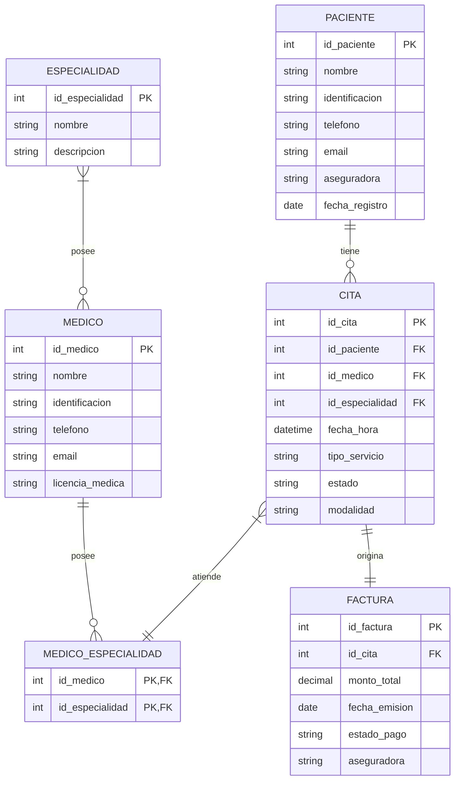
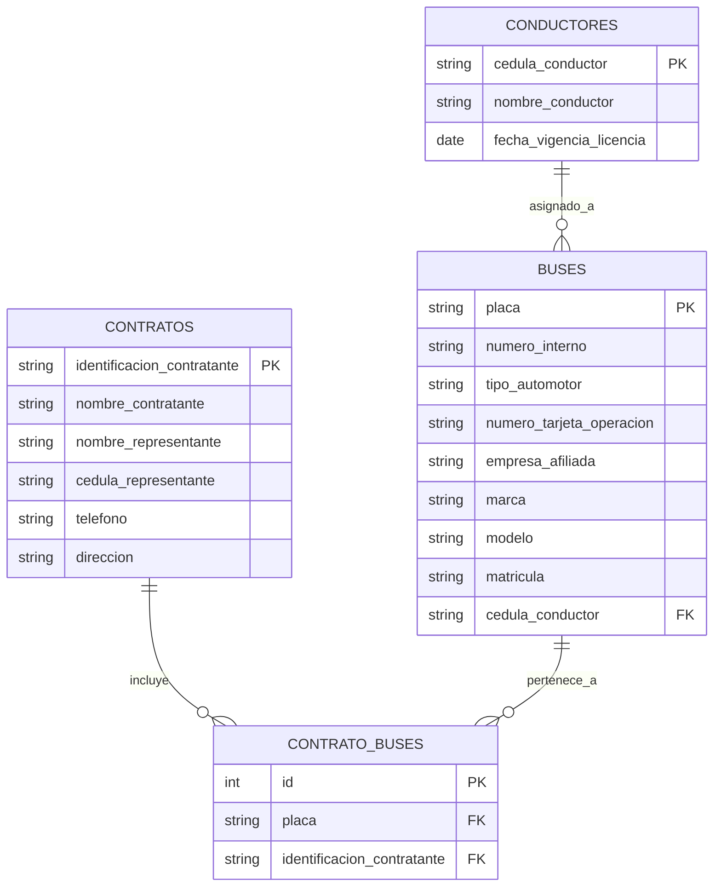

# Arq-Emp-Taller-2

**Taller 2 – Modelo Entidad Relación**

## 👥 Integrantes del Grupo

* Oscar Vergara
* Jaime Andres Olarte
* Juan David Moreno Suarez

## 📖 Descripción del Proyecto

Este repositorio contiene el desarrollo del Taller 2 de Arquitectura Empresarial, cuyo objetivo es modelar la estructura de datos utilizando el modelo Entidad-Relación (ER).

El taller se divide en dos partes principales:

* Modelado del caso base proporcionado (Clínica Salud Viva), donde se identificaron entidades como pacientes, médicos, citas y facturas.
* Modelado de un caso real correspondiente a la empresa TRANS CAPITAL S.A.S, donde se analizaron y estructuraron entidades como conductores, buses y contratos, basándose en los datos reales utilizados por la empresa.

Se utilizaron herramientas Mermaid para la creación del modelo ER mediante código y Markdown para la documentación del proyecto.

## 🎯 Objetivo

Aplicar el modelo Entidad-Relación (ER) para representar la estructura de datos de un sistema, identificando:

* Entidades principales del negocio
* Atributos relevantes de cada entidad
* Relaciones entre las entidades
* Cardinalidades y restricciones
* Claves primarias y foráneas

Esto permite comprender, organizar y estructurar la información de forma clara, facilitando el diseño de bases de datos consistentes y alineadas con las necesidades reales de la organización.

## ↗️ Modelos Entidad Relación

### Caso Base – 🏥 Clínica Salud Viva

El modelo entidad-relación de la clínica representa la gestión de citas médicas, incluyendo pacientes, médicos, especialidades, citas y facturación. Permite registrar qué paciente tiene una cita, qué médico la atiende y qué especialidad corresponde. Además, cada cita puede generar una factura, asegurando el control administrativo y financiero del servicio médico.



### Cliente Real – 🧠 Proceso Modelado

El modelo entidad-relación de **Trans Capital S.A.S** representa la gestión de conductores, buses y contratos. Permite identificar qué conductor tiene asignado un bus y qué buses están asociados a cada contrato. Además, la entidad intermedia CONTRATO_BUSES permite gestionar la relación de muchos a muchos entre contratos y buses, asegurando el control operativo y administrativo necesario para la generación de FUEC.



## 📁 Estructura del Repositorio

```
taller-01-bpmn/
│
├── README.md
│
├── clase/
│   ├── modelo-final-er-clinica.png
│   └── notas.md
│
├── entrega/
│   ├── modelo-final-er-transcapital.png
│   ├── informe.md
│   └── referencias.md
```

## ✅ Licencia

Este taller hace parte del curso de Arquitectura Empresarial - Universidad de La Sabana. Uso académico bajo licencia MIT.
