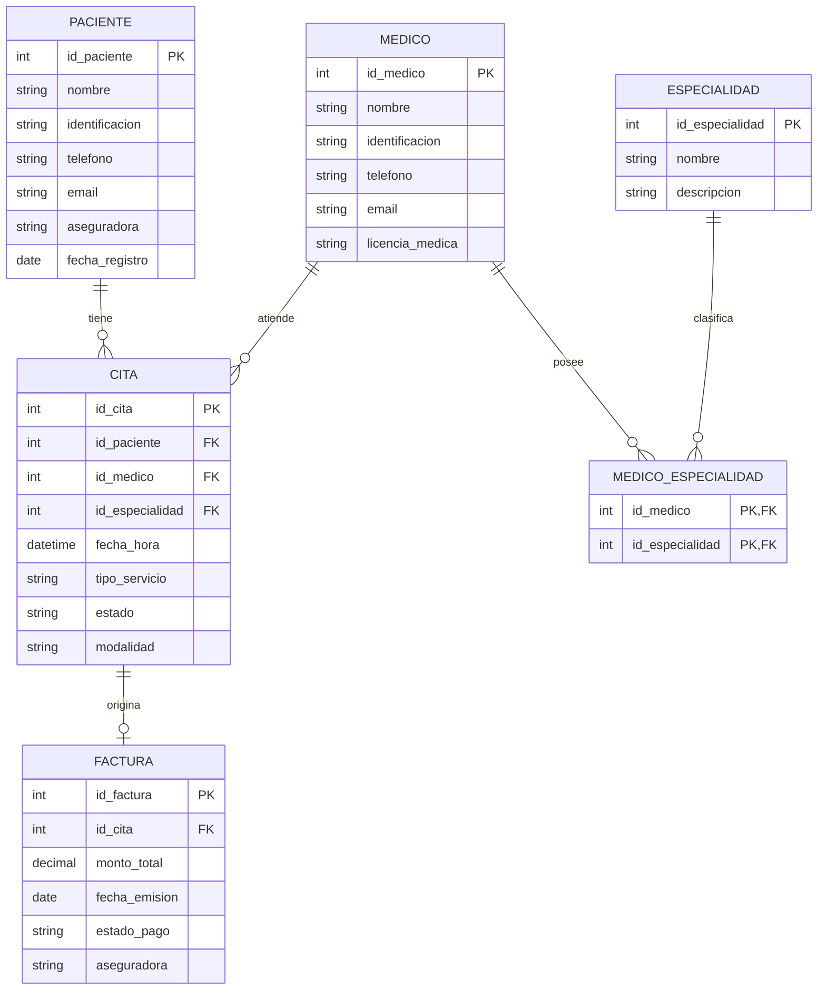

# 🗒️ Registro de Trabajo en Clase - Taller 2

## 📆 Fecha de la sesión

14/02/2026

## 👥 Integrantes presentes

* Oscar David Vergara
* Jaime Andrés Olarte
* Juan David Moreno

## 🧠 Actividades realizadas en clase

Durante la sesión se analizaron los requisitos del sistema y se identificaron las entidades principales: Paciente, Médico, Especialidad, Cita y Factura, junto con sus atributos, claves primarias y foráneas.

Se tomaron decisiones de modelado sobre las relaciones entre entidades, definiendo que un paciente puede tener varias citas, un médico puede atender múltiples citas y cada cita puede generar una factura. Además, se implementó una tabla intermedia llamada MEDICO_ESPECIALIDAD para representar la relación muchos a muchos entre médicos y especialidades.

Se utilizó Mermaid Live Editor para crear el diagrama entidad-relación de forma digital.

Finalmente, se logró desarrollar el modelo entidad-relación inicial completo con sus entidades, atributos y relaciones principales.

## 🧩 Boceto inicial del modelo

Se realizó el boceto inicial del modelo entidad-relación en formato digital utilizando Mermaid Live Editor, donde se definieron las entidades Paciente, Médico, Especialidad, Cita y Factura, junto con sus respectivas relaciones y atributos. Este boceto permitió visualizar la estructura general del sistema y validar la coherencia del modelo.

## 🔁 Tareas definidas para complementar el taller

| Tarea asignada                                  | Responsable         | Fecha estimada |
| ----------------------------------------------- | ------------------- | -------------- |
| Elaboración del diagrama final entidad-relación | Oscar David Vergara | 18/02/2026     |
| Revisión y validación del modelo de datos       | Jaime Andrés Olarte | 19/02/2026     |
| Redacción del informe y documentación           | Juan David Moreno   | 20/02/2026     |

_Este documento resume el trabajo colaborativo realizado durante la sesión del taller 2 en el curso AREM - Universidad de La Sabana._