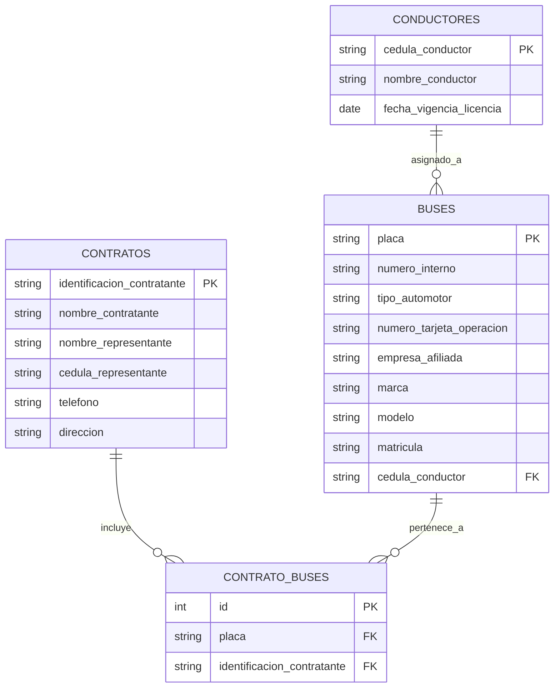

# 📄 Informe Técnico del Taller

## 🔖 Nombre del Taller

Taller 2 - Modelo Entidad Relación - Caso Real

## 👥 Integrantes del equipo

- Oscar David Vergara — [@Oscarvm117](https://github.com/Oscarvm117)
- Jaime Andrés Olarte — [@JAIMEPCI](https://github.com/JAIMEPCI)
- Juan David Moreno — [@285JuanDM](https://github.com/285JuanDM)

## 🧠 Descripción general del trabajo

El objetivo del taller fue diseñar un modelo entidad-relación basado en un caso real de la empresa Trans Capital S.A.S, la cual presta servicios de transporte terrestre especial. El propósito del modelo es estructurar la información relacionada con conductores, buses y contratos, con el fin de apoyar la digitalización y gestión de los documentos FUEC.

Durante la actividad, se analizaron los datos actuales de la empresa, los cuales se encontraban almacenados en archivos Excel, y se identificaron las principales entidades y relaciones necesarias para representar el funcionamiento del sistema de forma organizada y normalizada.

## 🔧 Proceso de desarrollo

Inicialmente se analizaron los archivos Excel proporcionados por la empresa para identificar los datos relevantes y entender cómo se relacionaban entre sí. A partir de este análisis, se definieron las entidades principales: Conductores, Buses y Contratos.

Posteriormente, se identificaron las relaciones entre estas entidades, determinando que un conductor puede estar asignado a varios buses y que un contrato puede incluir varios buses, lo que requirió la creación de una entidad intermedia llamada CONTRATO_BUSES para resolver la relación muchos a muchos.

Para el desarrollo del modelo se utilizó Mermaid Live Editor, lo que permitió construir el diagrama entidad-relación de forma clara y estructurada. Finalmente, se definieron las claves primarias y foráneas para garantizar la integridad referencial de la base de datos.

## 🧩 Análisis del modelo propuesto

El modelo se estructura en tres entidades principales: CONDUCTORES, BUSES y CONTRATOS, junto con una entidad intermedia llamada CONTRATO_BUSES que permite relacionar buses y contratos. Cada entidad contiene atributos relevantes que representan la información necesaria para la operación de la empresa.

Este modelo representa las necesidades del cliente al permitir organizar de forma estructurada la información de los vehículos, conductores y contratos, facilitando la futura implementación de un sistema digital para la generación de FUEC. Además, permite mantener la integridad de los datos y facilita la consulta de la información.

Se asumió que cada bus tiene un conductor asignado y que un contrato puede incluir uno o varios buses, así como que un bus puede participar en múltiples contratos. También se asumió que la información proporcionada en los archivos Excel refleja la operación actual de la empresa.

## 📈 Diagrama final entregado

Se adjunta el diagrama entidad-relación desarrollado en Mermaid, el cual representa las entidades, atributos y relaciones del sistema propuesto para la empresa Trans Capital S.A.S.

## 📋 Tabla de actores, entidades o componentes

| Nombre del elemento | Tipo    | Descripción                                                                      | Responsable |
| ------------------- | ------- | -------------------------------------------------------------------------------- | ----------- |
| Conductores         | Entidad | Representa los conductores de la empresa y su información personal y de licencia | Empresa     |
| Buses               | Entidad | Representa los vehículos utilizados para prestar el servicio de transporte       | Empresa     |
| Contratos           | Entidad | Representa los contratos con clientes que solicitan el servicio de transporte    | Empresa     |
| Contrato_Buses      | Entidad | Representa la relación entre los contratos y los buses asignados                 | Sistema     |

## 🔍 Investigación complementaria

### Tema investigado:

Buenas prácticas en el Modelado Entidad-Relación (ER)

### Resumen:

El modelo Entidad-Relación (ER) es una técnica fundamental en el diseño de bases de datos, ya que permite representar de forma clara y estructurada los elementos del mundo real que se desean almacenar en un sistema. Según Oracle, *“un modelo entidad-relación es una representación conceptual de los datos que identifica las entidades, sus atributos y las relaciones entre ellas”* [1]. Esto significa que antes de crear la base de datos física, es necesario construir un modelo lógico que permita entender cómo se relaciona la información dentro de la organización.

Una de las buenas prácticas más importantes es identificar correctamente las entidades principales del sistema, así como sus claves primarias. IBM afirma que *“las claves primarias permiten identificar de forma única cada instancia de una entidad, lo que garantiza la integridad de los datos”* [2]. En el caso de la empresa Transcapital, por ejemplo, la placa del bus y la cédula del conductor funcionan como identificadores únicos que permiten distinguir cada registro. Esto evita duplicidades y facilita la gestión de la información.

Otra práctica fundamental es definir adecuadamente las relaciones entre entidades. Lucidchart indica que *“las relaciones muestran cómo las entidades interactúan entre sí y permiten comprender la estructura lógica del sistema”* [3]. En este modelo, se identifican relaciones como la asignación de conductores a buses y la asociación de buses a contratos, lo cual refleja la operación real de la empresa. Estas relaciones permiten representar correctamente los procesos del negocio dentro de la base de datos.

Finalmente, el modelo ER ayuda a mejorar la organización y eficiencia del sistema de información. Microsoft señala que *“el modelado de datos ayuda a garantizar la consistencia, reducir la redundancia y mejorar la calidad general de los datos”* [4]. Esto es especialmente importante en empresas de transporte como Transcapital, donde se debe mantener un control preciso sobre vehículos, conductores y contratos.

En conclusión, la aplicación de buenas prácticas en el modelado ER permitió construir un modelo claro, organizado y alineado con las necesidades de la empresa Transcapital. Esto facilita el desarrollo posterior de la base de datos y asegura una gestión eficiente de la información.
