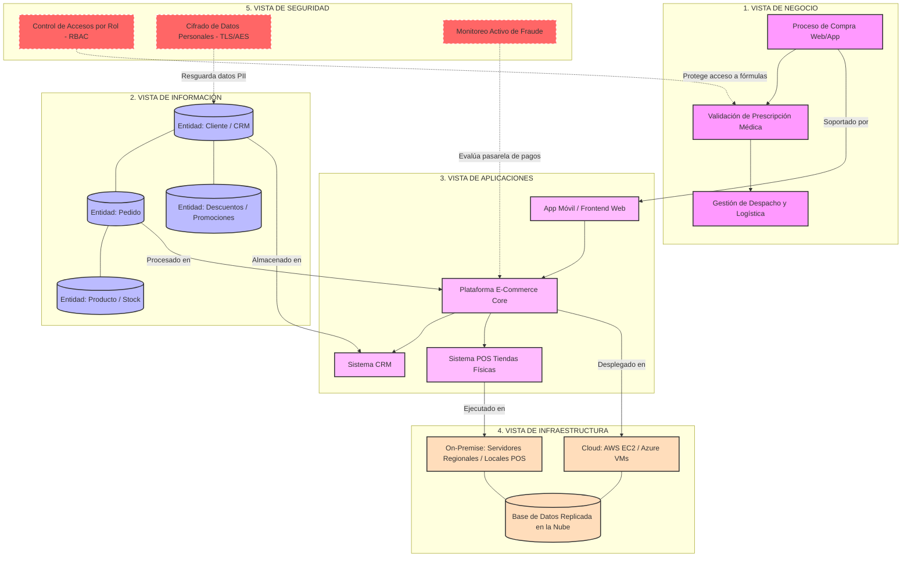

# Taller 7: Integración de Vistas de Arquitectura - FarmApp 💊🚗
> **Curso:** Arquitectura Empresarial | **Institución:** Universidad de La Sabana 

---

## 👥 Integrantes del Equipo
* Oscar David Vergara Moreno 
* Jaime Andrés Olarte 
* Juan David Moreno

---

## 🗺️ 1. Entregable A: Tablero de Vistas Integradas (Caso Base)
*Este tablero visual representa la interconexión completa de las 5 capas arquitectónicas solicitadas, garantizando que ningún componente quede aislado.*

## 🔍 3. Resumen de las Vistas Arquitectónicas

Para entender cómo funciona **FarmApp**, podemos dividir el sistema en 5 capas que trabajan en equipo. Ninguna funciona sola; cada una apoya a la siguiente:

### 1. Vista de Negocio (¿Qué hace la empresa?)
Es la capa que ve el cliente y la operación del negocio. Aquí se definen los pasos que se siguen en la vida real: desde que una persona entra a la aplicación a buscar un medicamento, pasando por la revisión obligatoria de su receta médica, hasta que el repartidor lleva el producto a su casa.

### 2. Vista de Información (¿Qué datos manejamos?)
Es el cerebro de los datos. Aquí organizamos la información clave que el negocio necesita recordar y procesar. Incluye las fichas de los **Clientes** (sus datos y alergias), el inventario de **Productos** (qué medicamentos hay y cuáles están agotados), los detalles de cada **Pedido** y los **Descuentos** que se le pueden aplicar a un usuario fiel.

### 3. Vista de Aplicaciones (¿Qué software usamos?)
Son los programas y plataformas que hacen posible el trabajo. En esta capa se encuentran la **App móvil** y la **Página Web** que usa el cliente, el **Sistema POS** (la pantalla que usan los cajeros en las tiendas físicas para cobrar) y el **CRM** (el sistema que administra las promociones y los datos de los clientes).

### 4. Vista de Infraestructura (¿Dónde corre todo?)
Es la maquinaria tecnológica física y virtual que sostiene los programas. FarmApp utiliza un modelo híbrido:
*   **La Nube:** Donde se guarda la página web, la app y la base de datos principal para que nunca se caigan y soporten miles de clientes a la vez.
*   **Servidores Locales:** Computadores físicos dentro de cada farmacia para que, si el internet se llega a ir, los cajeros puedan seguir vendiendo sin problemas.

### 5. Vista de Seguridad (¿Cómo nos protegemos?)
Es la capa que cuida todo el ecosistema de punta a punta. Se encarga de tres cosas críticas: que solo los empleados autorizados (como los farmacéuticos) puedan ver recetas médicas, que los datos personales y de tarjetas de los clientes viajen encriptados (secretos), y que haya un sistema vigilando en tiempo real para evitar fraudes con los pagos.
